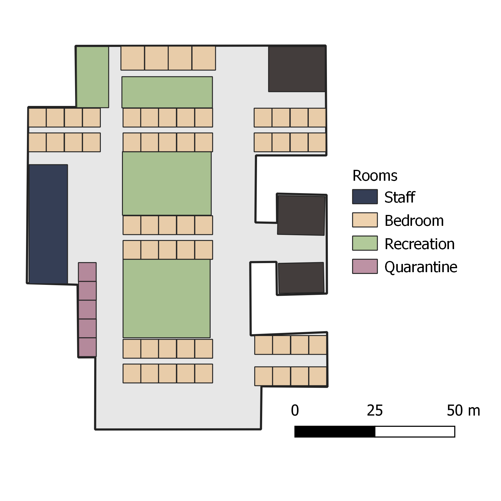

# Population

We present a spatial explicit stochastic agent based model that recreates the day to day dynamics in a typical nursery home during the COVID pandemic in the United States. Our time resolution for the model was every hour and we ran the model for 150 days.

## Population structure

We used the floor plans to recreate the spatial structure of a typical nursery home in the US (figure 1). The nursery home consist on 58 bedrooms designated for the residents, recreation areas (such as dining room, and activities rooms), and rooms for staff use. In the initial conditions there are 3 residents per room (total 174) and 170 staff divided into 3 different turns. The decision on the population distribution was based on information obtained from an interview with a nursery home in California.

# Population dynamics

In our simulation, an agent can interact with other agents based on its location. Given the current guidelines of recommendations for long term care facilities, there are no visitations and the residents spend most of the day in their rooms, so they can only interact with their roommates and the staff. In our model each resident will have at least one interaction with the staff per day which is based on different contact rates depending on the staff type (CN, RN, LPN), which will have different contact rates that were parametrized according on the average number of resident contacts in a normal day (REFERENCE: Table shared via email??). The contact rates are presented in table from supplementary materials.

| Type of staff | Distribution of resident contacts per turn |
|---------------|--------------------------------------------|
| CN            | $x\sim Mult(n,\pi)$                      |
| RN            | $x\sim Mult(n,\pi)$                      |
| LPN           | $x\sim Mult(n,\pi)$                      |

The staff agents are assigned to one of 3 different work schedules (morning, afternoon or night) and they spend 8 hours inside the nursery home and the rest of the time outside in the community, we only follow the agents inside the nursery home.

# Disease dynamics:

The transmission between agents inside the facility will depend on two parts, which are the probability that a person will shed the virus and the probability that another person will get the virus. We decided on model the transmission this way to represent scenarios where the infected and susceptible could have different combination of interventions (i.e. only infected received the intervention, only susceptible received the intervention, both received the intervention, etc..). The parametrization of the transmission parameters was based on observed outbreaks in nursery homes in California.

The introduction from the community to the facility depends on a parameter *Introduction\_p* that represents how likely is that a staff agent will be infected in the community.

Once the transmission between a infectious agent to a susceptible agent has been successful, the susceptible agent becomes exposed and based on a distribution for the latent period, the agent becomes infectious after $\lamda$ number of days, which can be either symptomatic and asymptomatic.

Model parameters:

| Name                     | Distribution      | Reference|
|--------------------------|-------------------|----------|
| Latent period ($\lambda$)| $Lognormal(7, 3)^a$| Fitted distribution based on [@He2020]|
| Shedding probability     | $0.4^b$            |          |
| Infection probability    | $0.4^b$            |          |
| Introduction probability | $0.01^b$           |          |
| Asymptomatic probability | $0.25^b$           |          |
| Hospitalization rate     | $0.11$             |          |
| Vaccine effect first and second dose| $60%$,$90%$|          |
| Vaccine immunity duration| $120\ days^b$      |          |
| Test detection probability| $75%$             |          |
| PPE Effect| | |

$^a$Truncated distribution between a boundary of reasonable values, $^b$explored for sensitivity analysis and scenario modeling

Susceptible

Scenarios to explore:

-   Use of PPE: In this scenario there will be a proportion of staff using PPE, this staff will have a reduced *GlobalTransmission\_p* based on an assumption of the effect of the PPE in reducing the transmission.  
-   Reintroduction of the disease from hospitalizations.  
-   Introduction via patients that go outside for extra services (physical theraphy, etc.).  
-   

## Incubation period

Table from paper by Park et al. [@Park2020]

| Author        | Sample Size  | Estimate (CI)  |
|:--------------|:-------------|:---------------|
| Li et al.     | 10 cases     | 5.2 (4.1. 7.0) |
| Backeret al.  | 88 cases     | 6.4 (5.6, 7.7) |
| Linton et al. | 158+52 cases | 5.6 (4.2, 6.3) |

## Pre symptomatic transmission

Infectiousness was observed [@He2020]:

-   0.1% 7 days prior symptom onset.  
-   1% 5 days prior symptoms onset.  
-   9% 3 days prior symptom onset.

Infectiousness was estimated to decline quickly within 7 days.

# References
